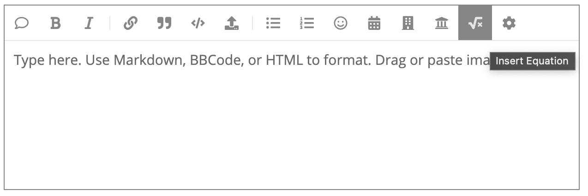
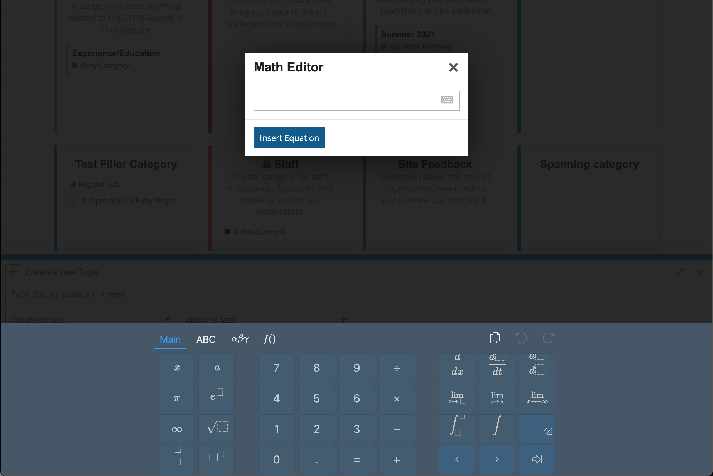

# Discourse Math Editor (Theme Component)

> This theme component is a converted version of the [plugin](https://github.com/spirobel/discourse-matheditor) created by [spirobel](https://github.com/spirobel).

This theme component allows you to enter math equations into Discourse in a more user friendly way. This editor helps you to create LaTeX. Please read on LaTeX [here](https://en.wikipedia.org/wiki/LaTeX) if you don't know what it is. For more documentation on all the LateX commands that you can use please have a look at the [mathlive documentation](http://mathlive.io/) and please watch this video on [YouTube](https://youtu.be/SOxe3-lxXlk)

## Installation

Please follow Discourse's guide on [how to install theme components](https://meta.discourse.org/t/how-do-i-install-a-theme-or-theme-component/63682).

> ⚠️ Note: You also need to use the [official Math Plugin](https://meta.discourse.org/t/discourse-math-plugin/65770) together with this. I recommend using KateX on your configuration instead of MathJax, as it is much faster.

## Screenshots

